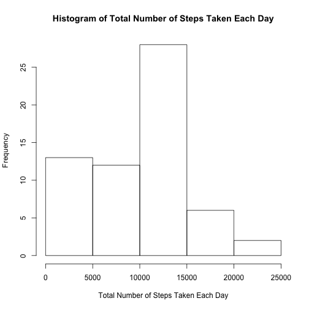
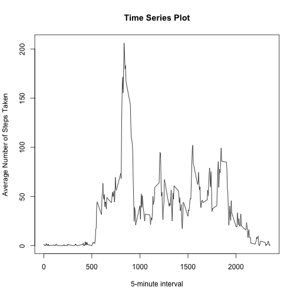
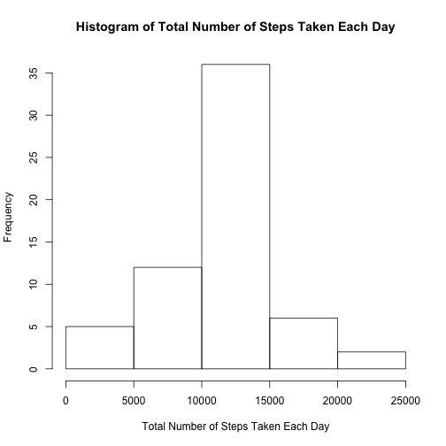
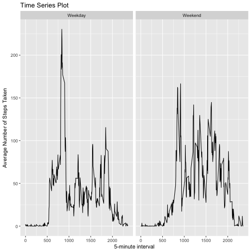

1.Loading and Processing data

```r
activity <- read.csv("activity.csv")
```

2.What is mean total number of steps taken per day?

```r
library(dplyr)
activity1 <- activity %>% group_by(date) %>% summarise(total = sum(steps,na.rm = T))

hist(activity1$total, main = "Histogram of Total Number of Steps Taken Each Day", xlab = "Total Number of Steps Taken Each Day")
```



```r
mean(activity1$total)
```

```
## [1] 9354.23
```

```r
median(activity1$total)
```

```
## [1] 10395
```

3.What is the average daily activity pattern?

```r
activity2 <- activity %>% group_by(interval) %>% summarise(average = mean(steps,na.rm = T))

plot(activity2$interval, activity2$average, type = "l",
     main = "Time Series Plot",
     xlab = "5-minute interval",
     ylab = "Average Number of Steps Taken")
```



```r
activity2[which.max(activity2$average),1]
```

```
## # A tibble: 1 x 1
##   interval
##      <int>
## 1      835
```

4.Imputing missing values

```r
sum(is.na(activity$steps))
```

```
## [1] 2304
```

```r
activity3 <- activity %>%
             group_by(interval) %>%
             mutate(steps =       
             ifelse(is.na(steps),mean(steps, na.rm = T),steps))

activity4 <- activity3 %>% group_by(date) %>% summarise(total = sum(steps,na.rm = T))

hist(activity4$total, main = "Histogram of Total Number of Steps Taken Each Day", xlab = "Total Number of Steps Taken Each Day")
```



```r
mean(activity1$total)
```

```
## [1] 9354.23
```

```r
median(activity1$total)
```

```
## [1] 10395
```

5.Are there differences in activity patterns between weekdays and weekends?

```r
activity3$weekday <- weekdays(as.Date(activity3$date))

activity3$factor <- as.factor(ifelse((activity3$weekday ==       
                           "Saturday" | activity3$weekday ==                                "Sunday"), "Weekend","Weekday"))

activity5 <- activity3 %>% group_by(interval,factor) %>% summarise(average = mean(steps))

library(ggplot2)
qplot(interval, average,data = activity5, 
      facets = .~factor, geom = "line",
     main = "Time Series Plot",
     xlab = "5-minute interval",
     ylab = "Average Number of Steps Taken")
```


